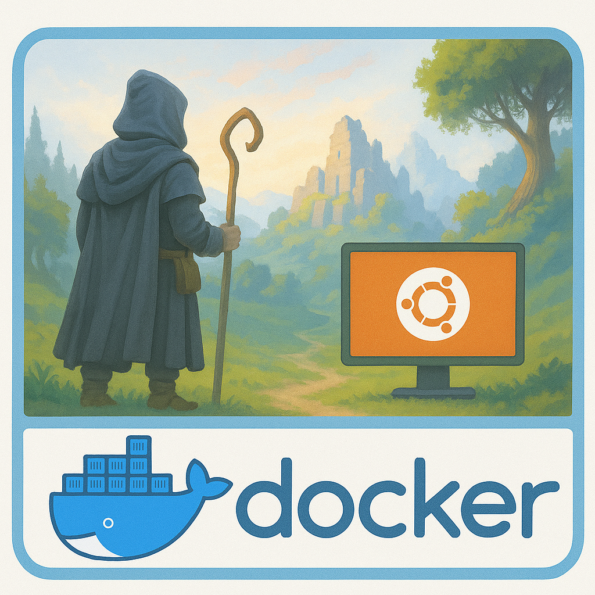

[](https://github.com/bonsaibauer/enshrouded_server_geproton)


[](https://github.com/bonsaibauer/enshrouded_server_geproton/issues/new)


<a href="https://github.com/bonsaibauer/enshrouded_server_ubuntu" target="_blank" style="display:inline-block; padding:20px 30px; background-color:#28a745; color:#ffffff; text-decoration:none; border-radius:10px; font-size:18px; font-weight:600; box-shadow:0 8px 20px rgba(0,0,0,0.2);">
  🐧 Use Ubuntu? Go to bonsaibauer/enshrouded_server_ubuntu →
</a>

<a href="https://github.com/bonsaibauer/enshrouded_server_docker" target="_blank" style="display: inline-block; padding: 16px 24px; background-color: #007bff; color: white; text-decoration: none; border-radius: 8px; font-size: 18px; font-weight: bold; box-shadow: 0 4px 6px rgba(0,0,0,0.1);">
  🐳 Use Docker? Go to bonsaibauer/enshrouded_server_docker →
</a>

# Setting Up an Enshrouded Dedicated Server with Docker: A Beginner's Guide

Embark on an adventure in the mystical world of Embervale with your own dedicated **Enshrouded** server. This guide walks you through setting up a dedicated server using **Docker**, making the process consistent and easy across different operating systems.

## Enshrouded: A Vast World of Survival and Magic

**Enshrouded** is an immersive survival action RPG set in a vast, voxel-based open world. Players must explore dangerous lands, craft for survival, and battle mystical creatures. The game supports cooperative multiplayer for up to 16 players, creating the perfect environment for shared adventures.

  
<sub>Image generated with the help of [ChatGPT](https://openai.com/chatgpt)</sub>

## Update v1.1 – Wake of the Water 2025-11 release


- Dynamically simulated water, water tools, and flooding safeguards bring bases to life.
- Veilwater Basin biome, new quests, enemies, and gear raise the progression cap to level 45.
- Fishing, greatswords, rebalanced loot, and workstation force requirements deepen crafting/combat.
- Dedicated servers now expose tags, a visitor role with terraforming limits, and improved admin tools.

### Full Settings + Example Config

- All server/gameplay fields are documented in [`docs/enshrouded_server.md`](docs/enshrouded_server.md).
- A complete sample with every setting populated ships in [`ressources/enshrouded_server.json`](ressources/enshrouded_server.json).
- The repo Docker assets live in [`ressources/`](ressources); run builds via `docker compose -f ressources/docker-compose.yml up -d`.

---

## 0. Preparing Your Environment

### Prerequisites

You can run the Enshrouded server inside a Docker container on **any operating system that supports Docker**, including but not limited to:

| Production-Ready Linux               | Desktop/Test Only                  | Notes                                                  |
|-------------------------------------|------------------------------------|--------------------------------------------------------|
| ✅ Ubuntu 24.04 LTS (recommended)   | ✅ macOS (Docker Desktop)          | ⚠️ Not suitable for hosting a live server              |
| ✅ Ubuntu 22.04 LTS                 | ✅ Windows 10/11 (WSL 2 + Docker Desktop) | ⚠️ Use for testing or development only       |
| ✅ Ubuntu 20.04 LTS                 |                                    |                                                        |
| ✅ Debian 12 / 11                   |                                    |                                                        |
| ✅ Fedora 38+                       |                                    |                                                        |
| ✅ Arch Linux                       |                                    | Rolling release — always up-to-date                    |
| ✅ AlmaLinux / Rocky Linux 9 / 8    |                                    | CentOS alternatives                                    |
| ✅ openSUSE Leap / Tumbleweed       |                                    |                                                        |

You’ll need:

- A system with Docker and Docker Compose installed
- sudo or administrative privileges
- `ufw` or firewall configuration (ensure port **15637** is open and forwarded)

# 1. Installing Docker (Ubuntu 24.04 and Other Linux Systems)

Docker allows you to run applications in isolated containers. It's ideal for deploying an Enshrouded dedicated server because it ensures consistency, portability, and easy management.

This guide will walk you through installing Docker on Ubuntu 24.04. These steps also work on most other Linux distributions with minor adjustments.

### Step 1: Update Your Package Index

Before installing anything, update your system to ensure all packages are current.

`Debian/Ubuntu`
```
sudo apt update && sudo apt upgrade -y
```
- `sudo apt update`: Refreshes the package index.
- `sudo apt upgrade -y`: Upgrades installed packages automatically.

> `Fedora`
> ```
> sudo dnf upgrade --refresh
> ```
> 
> `Arch Linux`
> ```
> sudo pacman -Syu
> ```

### Step 2: Install Required Dependencies

Docker relies on a few helper packages. Install them with:

```bash
sudo apt install apt-transport-https ca-certificates curl software-properties-common lsb-release gnupg -y
```

- `apt-transport-https`: Allows `apt` to use HTTPS.
- `ca-certificates`: Ensures your system trusts SSL certificates.
- `curl`: Command-line tool for downloading files.
- `software-properties-common`: Adds support for `add-apt-repository`.
- `lsb-release`: Provides OS version info.
- `gnupg`: Required for managing GPG keys.

### Step 3: Add Docker’s Official GPG Key

Docker signs its packages for security. Add their GPG key:

```bash
curl -fsSL https://download.docker.com/linux/ubuntu/gpg | sudo gpg --dearmor -o /usr/share/keyrings/docker-archive-keyring.gpg
```

### Step 4: Add Docker’s APT Repository

Configure your system to use Docker’s stable software repository:

```bash
echo   "deb [arch=$(dpkg --print-architecture) signed-by=/usr/share/keyrings/docker-archive-keyring.gpg]   https://download.docker.com/linux/ubuntu   $(lsb_release -cs) stable" | sudo tee /etc/apt/sources.list.d/docker.list > /dev/null
```

### Step 5: Install Docker Engine

Update your package index again and install Docker:

```bash
sudo apt update
sudo apt install docker-ce docker-ce-cli containerd.io -y
```

- `docker-ce`: Docker Community Edition
- `docker-ce-cli`: Docker command-line interface
- `containerd.io`: Container runtime used by Docker

Verify Docker is running:

```bash
sudo systemctl status docker
```

Press `q` to exit the status screen.

# 2. Create user and working directory

To allow the Docker container to persist game data and configurations, we create a dedicated system user and set up the correct directory.

Run these commands as root or with `sudo`:

```bash
# Create a system user 'enshrouded' without login shell
sudo useradd -m -r -s /bin/false enshrouded

# Ensure the home directory exists
sudo mkdir -p /home/enshrouded
sudo mkdir -p /home/enshrouded/enshrouded_server_geproton

# Set proper ownership 
sudo chown 1001:1001 /home/enshrouded/enshrouded_server_geproton
```

> 🛡️ This ensures that the container can write to `/home/enshrouded` and all server data stays in one clean location.

# 3. Deploy and Start docker container
**Option A: Clone repo (builds image locally)**
1) Clone and enter the repo:
```bash
git clone https://github.com/bonsaibauer/enshrouded_server_geproton.git
cd enshrouded_server_geproton
```
2) Edit the bundled compose:
```bash
nano ressources/docker-compose.yml
```
Set the environment section to your needs (see `READMEE.md` for full variable list). Common picks: `SERVER_NAME`/`SERVER_PASSWORD`, `SERVER_SLOT_COUNT`, `SERVER_QUERYPORT`, `SERVER_IP`, `PUID`/`PGID`, `SERVER_SAVE_DIR`, `SERVER_LOG_DIR`, `BACKUP_DIR`, `UPDATE_CRON`/`BACKUP_CRON`/`RESTART_CRON` (+ `*_MAX_COUNT`, `*_CHECK_PLAYERS`).
3) Start + logs:
```bash
docker compose -f ressources/docker-compose.yml up -d
docker compose -f ressources/docker-compose.yml logs -f
```

**Option B: Use the published image (no local build)**
1) Create a compose file anywhere:
```bash
nano docker-compose.yml
```
Example:
```yaml
services:
  enshrouded:
    image: mornedhels/enshrouded-server:latest
    container_name: enshrouded
    restart: unless-stopped
    stop_grace_period: 90s
    ports:
      - "15637:15637/udp"
    volumes:
      - /home/enshroudedserver:/opt/enshrouded/server
    environment:
      - SERVER_NAME=Der Silberberg
      - SERVER_IP=0.0.0.0
      - SERVER_SLOT_COUNT=16
      - SERVER_QUERYPORT=15637
      - SERVER_SAVE_DIR=./savegame
      - SERVER_LOG_DIR=./logs
      - SERVER_VOICE_CHAT_MODE=Proximity
      - SERVER_ENABLE_VOICE_CHAT=true
      - SERVER_ENABLE_TEXT_CHAT=true
      - PUID=4711
      - PGID=4711
      - UPDATE_CRON=*/30 * * * *
      - UPDATE_CHECK_PLAYERS=true
      - BACKUP_CRON="*/30 * * * *"   
      - BACKUP_DIR=./backups
      - BACKUP_MAX_COUNT=7           
      - RESTART_CRON="0 3 * * *"   
      - RESTART_CHECK_PLAYERS=true   
      - GAME_BRANCH=public
      - STEAMCMD_ARGS=validate
      - log_level=50
```
*(Password env is deprecated; use server roles instead.)*
See also: `docs/docker-compose.md` for a full compose env quick reference.
2) Run and watch logs:
```bash
docker compose up -d
docker compose logs -f
```

# 4. Edit server configuration

> 🔧 This file is located in the mounted directory:
> `/home/enshrouded/enshrouded_server_geproton/enshrouded_server.json`

```bash
nano enshrouded_server.json
```

Edit the `enshrouded_server.json` file to configure your server settings.

---

### General Server Settings

| Setting            | Description                                | Example / Default Value | Options / Notes          |
|--------------------|--------------------------------------------|--------------------------|---------------------------|
| **name**           | Name of the server                         | "Enshrouded Server"      | Any string                |
| **saveDirectory**  | Directory where savegames are stored       | "./savegame"             | File path                 |
| **logDirectory**   | Directory for log files                    | "./logs"                 | File path                 |
| **ip**             | Server IP binding                          | "0.0.0.0"                | Server ip adress          |
| ...                | ...                                        | ...                      | ...                       |

... [View full server settings here](https://github.com/bonsaibauer/enshrouded_server_geproton/blob/main/docs/enshrouded_server.md)

> **ℹ️ Note: Nano editor**
>
> After editing the `enshrouded_server.json` file, follow these steps to save your changes and exit the Nano editor:
>
> 1. **Save**:
>    - Press `CTRL + O` (this means "Write Out").
>    - Press `Enter` to confirm and save the file with the current name.
>
> 2. **Exit**:
>    - Press `CTRL + X` to close the Nano editor.
>
> You will then return to the regular command line.

# 5. Backup

## Backup

The image includes a backup script that creates a zip file of the last saved game state. To enable backups, set
the `BACKUP_CRON` environment variable. To limit the number of backups, set the `BACKUP_MAX_COUNT` environment variable.

To restore a backup, stop the server and simply extract the zip file to the savegame folder and start the server up
again. If you want to keep the current savegame, make sure to make a backup before deleting or overwriting the files.
Backups are written to `BACKUP_DIR` (default `./backups` inside the mounted server volume — `/home/enshroudedserver/backups` on the host with the provided compose file, or `/opt/enshrouded/server/backups` inside the container).

> [!WARNING]
> Verify the permissions of the extracted files. The files should be owned by the user with the UID and GID set in the
> environment variables. If the image is running in privileged mode, the files will be automatically chowned to the
> given `UID` and `GID`.

# 6. Commands

Docker container control (host)
- Stop container (graceful shutdown; data stays on volume)  
  Command: `docker stop enshrouded`
- Start container (boots existing container with current volumes/config)  
  Command: `docker start enshrouded`
- Restart container (stop + start; useful after ENV/compose changes)  
  Command: `docker restart enshrouded`
- Remove container (cleanup only; volumes/images remain)  
  Command: `docker rm enshrouded`

Supervisor actions inside the running container (host -> exec)
- Force update (delete manifest, run updater to pull latest build)  
  Command: `docker compose exec enshrouded supervisorctl start enshrouded-force-update`
- Reset roles (wipe `userGroups` in config, then stop container for a clean role reload)  
  Command: `docker compose exec enshrouded supervisorctl start enshrouded-reset-roles`
- Restart game server process (keeps container up; restarts the binary only)  
  Command: `docker compose exec enshrouded supervisorctl restart enshrouded-server`
- Manual backup (immediately zip latest save using current BACKUP_* settings)  
  Command: `docker compose exec enshrouded supervisorctl start enshrouded-backup`
- Trigger scheduled restart script now (honors RESTART_* checks)  
  Command: `docker compose exec enshrouded supervisorctl start enshrouded-restart`

*Supervisor (`supervisord`) manages the lifecycle of all helper programs inside the container: updater, game server, backup, restart, force-update, reset-roles, and cron. It keeps processes alive, wires their logs to STDOUT, and serializes tasks so updates/backups don’t overlap. The commands above ask `supervisord` to start or restart those programs on demand.*

*Backup specifics:* `enshrouded-backup` looks up the latest save folder, zips it into `BACKUP_DIR`, applies `BACKUP_MAX_COUNT` retention (0 = keep all), and honors `BACKUP_PRE_HOOK`/`BACKUP_POST_HOOK` if set. Cron-based backups are controlled by `BACKUP_CRON`; the manual command triggers the same logic immediately.

## Buy Me A Coffee
If this project has helped you in any way, do buy me a coffee so I can continue to build more of such projects in the future and share them with the community!

<a href="https://buymeacoffee.com/bonsaibauer" target="_blank"></a>

