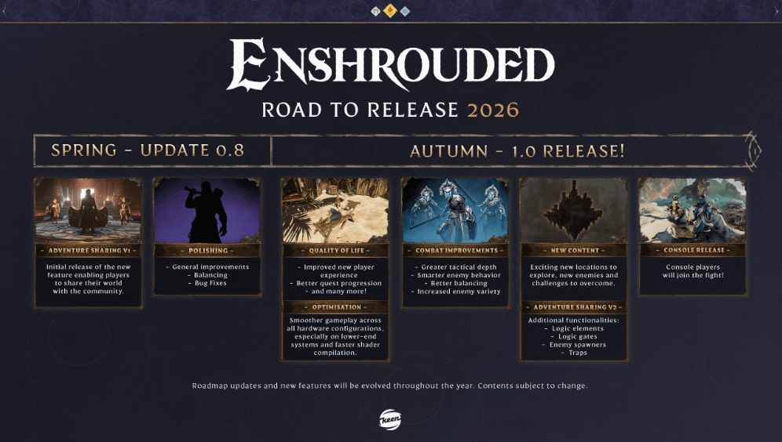

[](https://github.com/bonsaibauer/enshrouded_server_geproton)


# Enshrouded Dedicated Server (Docker + GE-Proton) — Road to Release 2026

> Code foundation: [mornedhels/enshrouded-server](https://github.com/mornedhels/enshrouded-server) — huge thanks. His repo is a feature-rich base; this repository [bonsaibauer/enshrouded_server_geproton](https://github.com/bonsaibauer/enshrouded_server_geproton) is a simplified, beginner-focused tutorial that narrows the scope to GE-Proton + supervisor so newcomers can get a performant server running fast.

> [!IMPORTANT]
> This setup uses GE-Proton and supervisord and is regarded in the community as the best, most resource-friendly configuration for Enshrouded servers on Linux. The game ships with no native Linux binary and previously ran only via Wine with noticeable performance loss. GE-Proton lets the Windows build run fast and stable.

Greetings, Flameborn!  
Grab a potion and read on: this is the most concise guide to spin up your own Enshrouded server in Docker — tuned for low resource usage, automatic updates, backups, and clean process control via Supervisor.



---

# 1. Installing Docker (Ubuntu 24.04 and Other Linux Systems)

Docker allows you to run applications in isolated containers. It's ideal for deploying an Enshrouded dedicated server because it ensures consistency, portability, and easy management.

This guide will walk you through installing Docker on Ubuntu 24.04. These steps also work on most other Linux distributions with minor adjustments.

### Step 1: Update Your Package Index

Before installing anything, update your system to ensure all packages are current.

`Debian/Ubuntu`
```
sudo apt update && sudo apt upgrade -y
```
- `sudo apt update`: Refreshes the package index.
- `sudo apt upgrade -y`: Upgrades installed packages automatically.

> `Fedora`
> ```
> sudo dnf upgrade --refresh
> ```
> 
> `Arch Linux`
> ```
> sudo pacman -Syu
> ```

### Step 2: Install Required Dependencies

Docker relies on a few helper packages. Install them with:

```bash
sudo apt install apt-transport-https ca-certificates curl software-properties-common lsb-release gnupg -y
```

- `apt-transport-https`: Allows `apt` to use HTTPS.
- `ca-certificates`: Ensures your system trusts SSL certificates.
- `curl`: Command-line tool for downloading files.
- `software-properties-common`: Adds support for `add-apt-repository`.
- `lsb-release`: Provides OS version info.
- `gnupg`: Required for managing GPG keys.

### Step 3: Add Docker’s Official GPG Key

Docker signs its packages for security. Add their GPG key:

```bash
curl -fsSL https://download.docker.com/linux/ubuntu/gpg | sudo gpg --dearmor -o /usr/share/keyrings/docker-archive-keyring.gpg
```

### Step 4: Add Docker’s APT Repository

Configure your system to use Docker’s stable software repository:

```bash
echo   "deb [arch=$(dpkg --print-architecture) signed-by=/usr/share/keyrings/docker-archive-keyring.gpg]   https://download.docker.com/linux/ubuntu   $(lsb_release -cs) stable" | sudo tee /etc/apt/sources.list.d/docker.list > /dev/null
```

### Step 5: Install Docker Engine

Update your package index again and install Docker:

```bash
sudo apt update
sudo apt install docker-ce docker-ce-cli containerd.io -y
```

- `docker-ce`: Docker Community Edition
- `docker-ce-cli`: Docker command-line interface
- `containerd.io`: Container runtime used by Docker

Verify Docker is running:

```bash
sudo systemctl status docker
```

Press `q` to exit the status screen.

# 2. Create user and working directory

To allow the Docker container to persist game data and configurations, we create a dedicated system user and set up the correct directory.

Run these commands as root or with `sudo`:
### Step 2.1: Create a system user 'enshrouded' without login shell
```bash
sudo useradd -m -r -s /bin/false enshrouded
```
### Step 2.2: Ensure the home directory exists
```bash
sudo mkdir -p /home/enshrouded
```
```bash
sudo mkdir -p /home/enshrouded/enshrouded_server_geproton
```
### Step 2.3 Set proper ownership 
```bash
sudo chown 1001:1001 /home/enshrouded/enshrouded_server_geproton
```

> 🛡️ This ensures that the container can write to `/home/enshrouded` and all server data stays in one clean location.

# 3. Deploy and Start docker container
### Step 3.1 Go to Directory:
```bash
cd /home/enshrouded/
```
### Step 3.2 Clone and enter the repo:
```bash
git clone https://github.com/bonsaibauer/enshrouded_server_geproton.git
```
```bash
cd enshrouded_server_geproton
```
### Step 3.3 Edit the bundled compose:
```bash
nano ressources/docker-compose.yml
```

   - The compose file lists all configurable environment variables. By default it:
     - exposes UDP port `15637` on the host (`SERVER_QUERYPORT` + `ports` mapping) for game queries/traffic.
     - mounts `/home/enshrouded/enshrouded_server_geproton` into `/opt/enshrouded/server` for saves, logs, and backups.
     - names the server `Enshrouded Server` with `16` slots, voice/text chat enabled, and `Global` voice mode.
     - schedules automatic updates hourly (`UPDATE_CRON="0 * * * *"`) and nightly backups at 00:00 (`BACKUP_CRON="0 0 * * *"`, keeping `14` copies).
     - restarts daily at 03:00 (`RESTART_CRON="0 3 * * *"`) and skips update/restart if players are online (`*_CHECK_PLAYERS=true`).
     - uses Steam branch `public` and runs `validate` via `STEAMCMD_ARGS`.
   - Keep these defaults or adjust any env values directly in `ressources/docker-compose.yml` before starting.

### Docker Compose Defaults (Option B)

| Setting / Key   | Description                                 | Default Value                          | Options / Notes                 |
|-----------------|---------------------------------------------|----------------------------------------|---------------------------------|
| **image/build** | Uses bundled Dockerfile to build the image  | `mornedhels/enshrouded-server:dev-proton` | Build context `.` / `ressources/Dockerfile` |
| **ports**       | Publishes game/query port                   | `15637:15637/udp`                      | Change host port if needed      |
| **volumes**     | Host path for saves/logs/backups            | `/home/enshrouded/enshrouded_server_geproton:/opt/enshrouded/server` | Point to your preferred path    |
| **SERVER_NAME** | Server name shown in browser                | `Enshrouded Server`                    | Any string                      |
| …               | …                                           | …                                      | … (see link below)              |

... [View full compose/env list here](docs/environment-variables.md)

> **ℹ️ Note: Nano editor**
>
> After editing `ressources/docker-compose.yml`, save and exit Nano:
> 1. **Save**: `CTRL + O`, then `Enter`
> 2. **Exit**: `CTRL + X`
>
> You will return to the shell after saving.

### Step 3.4 Start + logs:
```bash
docker compose -f ressources/docker-compose.yml up -d
```
then check the logs:
```bash
docker compose -f ressources/docker-compose.yml logs -f
```
# 4. Edit server configuration

> 🔧 This file is located in the mounted directory:
> `/home/enshrouded/enshrouded_server_geproton/enshrouded_server.json`

```bash
nano enshrouded_server.json
```

Edit the `enshrouded_server.json` file to configure your server settings.

---

### General Server Settings

| Setting            | Description                                | Example / Default Value | Options / Notes          |
|--------------------|--------------------------------------------|--------------------------|---------------------------|
| **name**           | Name of the server                         | "Enshrouded Server"      | Any string                |
| **saveDirectory**  | Directory where savegames are stored       | "./savegame"             | File path                 |
| **logDirectory**   | Directory for log files                    | "./logs"                 | File path                 |
| **ip**             | Server IP binding                          | "0.0.0.0"                | Server ip adress          |
| ...                | ...                                        | ...                      | ...                       |

... [View full server settings here](https://github.com/bonsaibauer/enshrouded_server_geproton/blob/main/docs/enshrouded_server.md)

> **ℹ️ Note: Nano editor**
>
> After editing the `enshrouded_server.json` file, follow these steps to save your changes and exit the Nano editor:
>
> 1. **Save**:
>    - Press `CTRL + O` (this means "Write Out").
>    - Press `Enter` to confirm and save the file with the current name.
>
> 2. **Exit**:
>    - Press `CTRL + X` to close the Nano editor.
>
> You will then return to the regular command line.

# 5. Backup

## Backup

The image includes a backup script that creates a zip file of the last saved game state. To enable backups, set
the `BACKUP_CRON` environment variable. To limit the number of backups, set the `BACKUP_MAX_COUNT` environment variable.

To restore a backup, stop the server and simply extract the zip file to the savegame folder and start the server up
again. If you want to keep the current savegame, make sure to make a backup before deleting or overwriting the files.
Backups are written to `BACKUP_DIR` (default `./backups` inside the mounted server volume — `/home/enshroudedserver/backups` on the host with the provided compose file, or `/opt/enshrouded/server/backups` inside the container).

# 6. Server Commands
Supervisor actions inside the running container
### Force update 
...delete manifest, run updater to pull latest build
  ```bash
docker compose exec enshrouded supervisorctl start enshrouded-force-update
```
### Reset roles 
...wipe `userGroups` in config, then stop container for a clean role reload
  ```bash
docker compose exec enshrouded supervisorctl start enshrouded-reset-roles
```  
### Restart game server process 
...keeps container up; restarts the binary only
  ```bash
docker compose exec enshrouded supervisorctl restart enshrouded-server
```  
### Manual backup 
...immediately zip latest save using current BACKUP_* settings
  ```bash
docker compose exec enshrouded supervisorctl start enshrouded-backup
```  
### Trigger scheduled restart script now 
...honors RESTART_* checks
  ```bash
docker compose exec enshrouded supervisorctl start enshrouded-restart
```

*Supervisor (`supervisord`) manages the lifecycle of all helper programs inside the container: updater, game server, backup, restart, force-update, reset-roles, and cron. It keeps processes alive, wires their logs to STDOUT, and serializes tasks so updates/backups don’t overlap. The commands above ask `supervisord` to start or restart those programs on demand.*

---

# 7. Docker Commands
### Stop container 
...graceful shutdown; data stays on volume
```bash
docker stop enshrouded
```
### Start container
...boots existing container with current volumes/config
```bash
docker start enshrouded
```
### Restart container
...stop + start; useful after ENV/compose changes
```bash
docker restart enshrouded
```
### Remove container
...cleanup only; volumes/images remain
```bash
docker rm enshrouded
```
---

# Conclusion

By following this guide, you've set up your own Enshrouded dedicated server on Ubuntu, ready to host your adventures in the mystical world of Embervale. Gather your friends and start your journey in this captivating survival action RPG.

## Buy Me A Coffee
If this project has helped you in any way, do buy me a coffee so I can continue to build more of such projects in the future and share them with the community!

<a href="https://buymeacoffee.com/bonsaibauer" target="_blank"></a>

